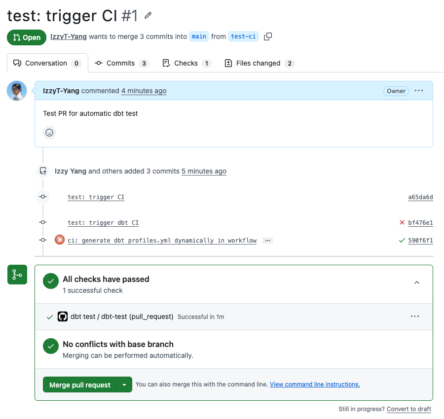

# HK Data Pipeline

An end-to-end data engineering project that ingests Hong Kong weather and air quality data from Open-Meteo, loads it into BigQuery, transforms it with dbt, orchestrates daily runs with Apache Airflow on GCP, and visualizes results in Looker Studio.

## Architecture

```
Open-Meteo API (weather + air quality)
        │
        ▼
  Python ingestion scripts
  (weather_report.py, air_quality.py)
        │
        ▼
  GCS — raw JSON files (one per day per source)
        │
        ▼
  BigQuery — raw tables
  (gcs_to_bq.py, batched load)
        │
        ▼
  dbt — staging (dedup) → mart (daily aggregations) → combined
        │
        ▼
  Looker Studio Dashboard
```

## Stack

| Layer | Tool |
|---|---|
| Data source | Open-Meteo API (weather + air quality) |
| Ingestion | Python + GCS |
| Storage | Google Cloud Storage + BigQuery |
| Transformation | dbt (BigQuery adapter) |
| Orchestration | Apache Airflow (Docker Compose on GCP VM) |
| Containerization | Docker + Artifact Registry |
| Visualization | Looker Studio |

## Project Structure

```
hk-data-pipeline/
├── ingestion/
│   ├── weather_report.py   # Open-Meteo weather → GCS
│   ├── air_quality.py      # Open-Meteo air quality → GCS
│   ├── gcs_to_bq.py        # GCS → BigQuery (batched)
│   ├── utils.py            # shared GCS upload + GCP credentials
│   ├── requirements.txt
│   └── Dockerfile
├── dbt/
│   ├── models/
│   │   ├── staging/        # dedup raw data
│   │   └── mart/           # daily aggregations + combined
│   ├── profiles_prod.yml
│   └── Dockerfile
├── airflow/
│   ├── dags/
│   │   └── hk_daily_etl.py # DAG: ingest → load → dbt (DockerOperator)
│   ├── docker-compose.yml  # local / VM Airflow (webserver, scheduler, postgres)
│   └── requirements.txt    # apache-airflow-providers-docker
└── dashboard/              # Looker Studio screenshots
```

## dbt Models

```
raw.weather / raw.air_quality
        │
        ▼
staging.stg_weather / staging.stg_air_quality   (deduplicated views)
        │
        ▼
mart.mart_daily_weather                          (daily weather aggregations)
mart.mart_daily_air_quality                      (daily AQI aggregations)
        │
        ▼
mart.mart_daily_combined                         (joined weather + air quality)
```

## Setup

### Prerequisites
- GCP project with BigQuery, GCS, and Artifact Registry enabled
- Docker Desktop (local) or Docker Engine (VM)
- `gcloud` CLI authenticated

### 1. Local development (scripts only)

```bash
# install dependencies
cd ingestion && pip install -r requirements.txt

# run ingestion locally (today's data)
python weather_report.py
python air_quality.py

# load to BigQuery
python gcs_to_bq.py

# run dbt
cd ../dbt && dbt run --profiles-dir . --project-dir .
```

### 2. Build and push Docker images

For a GCP VM (linux/amd64), build with an explicit platform if your Mac is Apple Silicon:

```bash
gcloud auth configure-docker asia-east2-docker.pkg.dev

docker build --platform linux/amd64 \
  -t asia-east2-docker.pkg.dev/<project>/hk-pipeline/ingestion:latest ./ingestion
docker build --platform linux/amd64 \
  -t asia-east2-docker.pkg.dev/<project>/hk-pipeline/dbt:latest ./dbt

docker push asia-east2-docker.pkg.dev/<project>/hk-pipeline/ingestion:latest
docker push asia-east2-docker.pkg.dev/<project>/hk-pipeline/dbt:latest
```

### 3. Airflow (local)

```bash
cd airflow
echo "AIRFLOW_UID=$(id -u)" > .env
docker compose up airflow-init
docker compose up -d
# UI at http://localhost:8082  (admin / admin)
```

### 4. Configure Airflow Variable

In the Airflow UI: **Admin → Variables**

| Key | Value |
|-----|-------|
| `GCP_SERVICE_ACCOUNT_KEY` | GCP service account JSON |

Or via CLI (from `airflow/`):

```bash
docker compose exec -T airflow-webserver \
  airflow variables set GCP_SERVICE_ACCOUNT_KEY "$(cat ../secrets/gcp-sa-key.json)"
```

Keep service account JSON out of git (see `.gitignore` / `secrets/`).

### 5. Run the pipeline

- **Daily (automated)**: DAG `hk_daily_etl` schedule `0 8 * * *` (Asia/Hong_Kong)
- **Manual / backfill**: Trigger DAG with params `start_date`, `end_date`, and toggles `run_ingest` / `run_load` / `run_transform`

Tasks use `DockerOperator` to run the ingestion and dbt images from Artifact Registry (Docker socket mounted into Airflow).

### 6. Deploy on a GCP VM (optional)

Same `airflow/docker-compose.yml` on a VM in `asia-east2` (recommend at least `e2-small`, 30GB disk):

1. Install Docker + Compose plugin on the VM
2. `gcloud auth configure-docker asia-east2-docker.pkg.dev`
3. Clone the repo, `cd airflow && docker compose up -d`
4. Open firewall for TCP `8082`, then visit `http://<VM_EXTERNAL_IP>:8082`
5. Set Variable `GCP_SERVICE_ACCOUNT_KEY` as above

## CI/CD

dbt tests run automatically on every pull request that touches the `dbt/` directory via GitHub Actions.

The workflow (`.github/workflows/dbt_test.yml`):
1. Installs `dbt-bigquery`
2. Writes GCP credentials from repository secret `GCP_SERVICE_ACCOUNT_KEY`
3. Runs `dbt run` + `dbt test` against the production BigQuery dataset



## Dashboard

[View Live Dashboard](https://datastudio.google.com/reporting/967f5202-3002-48b0-990b-cb67b4eabd59)


